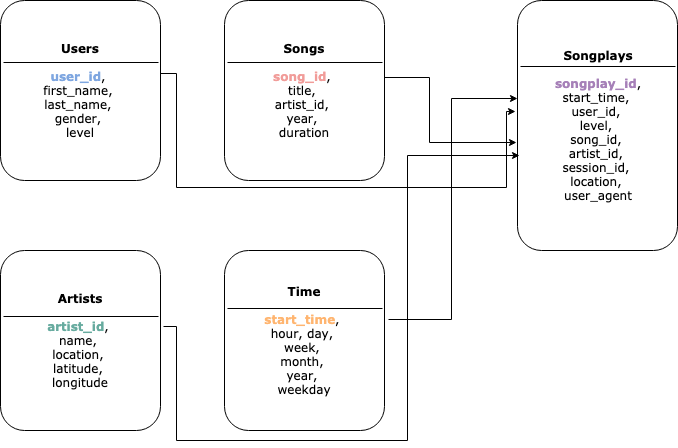

## Sparkify ETL with AWS
Udacity project on Datalakes with Spark

### Data Modelling with Apache Spark and AWS
- This data warehousing project is based on PySpark (Apache Spark with Python)
- The reason behind choosing spark model is to optimize the speed of ETL
 and manage the cloud-based-infrastructure with more flexibility in 
 terms of money, speed and resources
- The infrastructure as code (IAC) model used in this project is very 
easy, requires very few manual efforts to set up
- Currently, we have a star schema architecture with **Artists, Users, 
Time, and Songs** tables used as dimension tables and **Songplays** table is used as 
Facts table because Songplays will have events that happened at different points in time, 
 and different dimensions will give us different perspectives to the facts table
- The distribution and sorting of different tables across the storage will help
optimizing the storage and also take advantage of the columnar format
- The code is written in Python, just by using the code, and following 
the instructions one can set up a mini cloud data warehousing 
architecture with spark very easily and in minutes
  
### The Star Schema that we are going to design here


Here you can see the Songplays table is actually the facts and others
connecting to it are dimensions. It's a simple star schema and the first
bold and colorful column name is the primary key for this table which 
are serving as foreign keys in Songplays table.

### Getting Started
Download the project:
You can download it as zip and unpack the files or you can clone this
repository

#### Prerequisites
- One should have anaconda/miniconda installed in his/her machine
- Signup for an AWS account
- Create an IAM User (https://docs.aws.amazon.com/IAM/latest/UserGuide/id_users_create.html)
   - The user created by you in AWS should have read and write access to S3
- Get your secret key and access key https://docs.aws.amazon.com/general/latest/gr/aws-sec-cred-types.html
   - Download as CSV the generated key and the secret
     for dl.cfg file
- Update dl.cfg with the key and the secret
- Create your s3 storage bucket and update the dl.cfg accordingly, in the
output currently is my s3 bucket which isn't publicly available so you have to create one and write down accordingly

#### Installing and starting

##### Installing Python Dependencies
You need to install this python dependencies
In Terminal/CommandPrompt:  
- Step 1: At first open: anaconda prompt/cmder/Command prompt/terminal and
 go inside the cloned directory

- Step 2: Now, with the first step already completed,   

  without anaconda you can do this:
    ```
    $ python3 -m venv virtual-env-name
    $ source virtual-env-name/bin/activate
    $ pip install -r requirements.txt
    ```
    with anaconda you can do this:
    ```
    $ conda env create -f env.yml
    $ source activate <conda-env-name>
    ```
    or
    ```
    conda create -y -n <conda-env-name> python==3.6
    conda install -f -y -q -n <conda-env-name> -c conda-forge --file requirements.txt
    [source activate/ conda activate] <conda-env-name>
    ```

##### Executing the creation and extraction scripts

- Step 1: Run the below code to read from S3 storage of Udacity and 
create tables on the run and save in columnar format with parquet on your
own s3 storage directory
    ```bash
    $ python etl.py
    ```

### About the data
Song Data is collected from the Million Song Dataset   
Check: http://millionsongdataset.com/

Log Data is generated artificially  
Check: https://github.com/Interana/eventsim

### Example Queries
For the most popular songs over the time (considering your schema name 
is sparkify)
```
SELECT s.title, count(*) as count
FROM songplays sp
INNER JOIN songs s ON s.song_id = sp.song_id
GROUP BY s.title
ORDER BY count DESC, s.title ASC
```
For the most popular artists and their songs over the time (considering 
your schema name is sparkify)
```
SELECT ar.name, s.title, count(*) as count
FROM songplays sp
INNER JOIN songs s ON s.song_id = sp.song_id
INNER JOIN artists ar ON ar.artist_id = sp.artist_id
GROUP BY ar.name, s.title
ORDER BY count DESC, ar.name, s.title ASC;
```
### View and Analyze
- The Tester.ipynb notebook is there to test your data with different
queries (already some pre-written there)
- Run block by block to 
    - setup spark session
    - load data into spark frame
    - query the dataframe

### Warning
<span style="color:red">
    Do not share your AWS KEY and AWS SECRET in github! You will get 
    calls from DC right away! And trust me on this
</span>
 
### Authors
* **Supratim Das** - *Initial work*